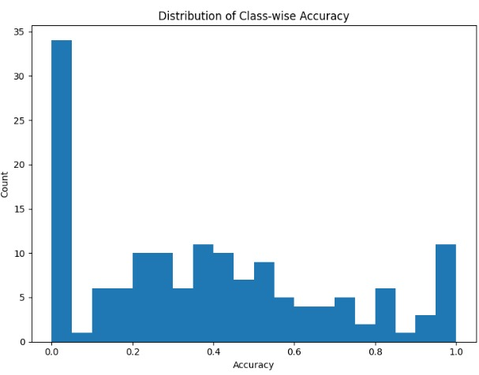
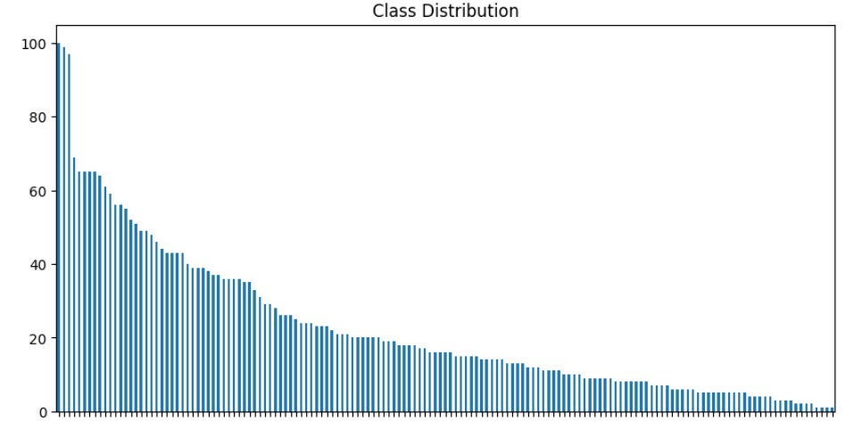
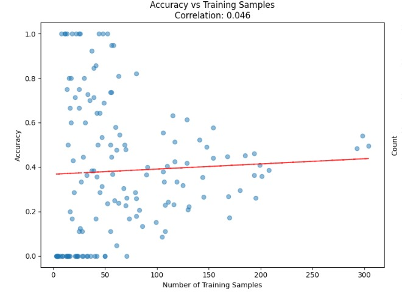
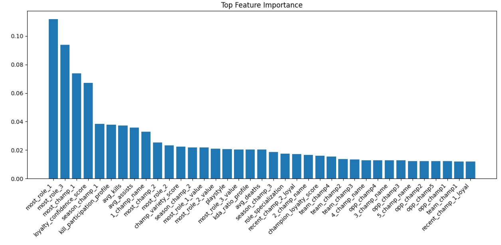
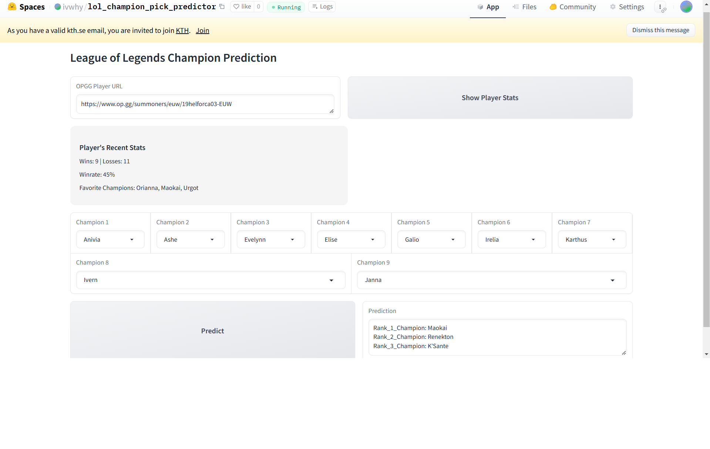

# ID2223 Final Project: League of Legends Champion Predictor ML System

---

## Introduction
In this project, we developed a web scraper specifically for the website OP.GG, a popular database and analytics platform for the game League of Legends. OP.GG provides detailed statistics and information about players, champions, and matches, making it a go-to resource for the game's community. While Riot Games offers an official API for retrieving data, its limitation of daily refresh intervals poses challenges for real-time machine learning systems. If the API data is not consistently retrieved and updated, the system becomes unreliable. By leveraging a web scraper, we ensured timely and continuous access to the most recent match data, enabling our model to function effectively.

The core of this project is an XGBoost model that predicts the champion pick of the final player in a match. The model uses a variety of input parameters, which are represented in a tabular format, to make its predictions. These inputs include match-specific details such as player statistics, team compositions, and champion selection trends.

One practical application of this machine learning system is in the context of League of Legends competitive scene. Drafting strategy has been a critical aspect of in LoL professional scenes, as it provides competitive edge in professional matches. Teams have been adding coach and analyst in order to enhance their match preparation. By accurately forecasting champion selections, this system can be a valuable assistant in aiding match preparation through predicting various champions draft variable and composition.

---

## Dataset
### Data Collection:
Dataset was taken from 857 high profile/ranked players from the leaderboard from 4 most relevant regions in competitive scene (Korea, Western Europe, North America and Veitnam). Each player provides individual and matches statistics which amount to approximately 17000 rows. Champions stats and meta trend were also collected to provide better context and additional features to engineer. Due to the nature of the data which is refreshed periodically, and the high processing demand of scrapping data, it can be challenging to provide matching up-to-date data for feature engineering. This might create unintended shift which may influence the training outcome.

Features engineering was applied to the dataset after collection. The biggest part is individual champion score to aid label prediction. This score is an aggregation of various player's individual performance profile and occurring trend. Further features engineering was applied to provide more meaningful feature to the model, such as playstyle derived from player's average performance, player's loyalty to certain champion and role distribution. All of these feature engineering are intended to minimize noise in dataset and improve model performance through better dataset interpretability. The dataset started with more than 350 columns, and was featured engineered to less than 40 columns.

### Feature Engineering:
1. **Champion Score:** Aggregated metrics from player performance and trends.
2. **Player Playstyle:** Derived from average performance metrics.
3. **Champion Loyalty:** Player preferences for specific champions.
4. **Role Distribution:** Statistical role preferences.

---

## Methodology
### System Overview
The proposed system predicts the champion pick of the final player in a League of Legends match using data from OP.GG. The architecture consists of four major components: data collection, model training, model hosting, and user interaction.

### 1. Data Collection
A custom web scraper was developed to extract match data directly from OP.GG. This scraper retrieves raw match details, including player statistics, team compositions, and champion selection trends. The data is then preprocessed to ensure consistency, handle missing values, and convert it into a format suitable for machine learning.

### 2. Model Training
XGBoost Classifier model was selected for its suitability to handle champion categorical nature. The data collected from OP.GG was split into training, validation and testing datasets. The model was trained using features such as player statistics, previous champion selections, and team composition as described in dataset section. Dataset with low unique values is converted to categorical type to utilize XGBoost Classifier category features. The training process involved parameter tuning and gradual low impact features removal to optimize model performance, ensuring gardual improvement in model performance to provide high prediction accuracy. 

Some other XGBoost Classifier features that were utilized in the training process is objective='multi:softprob' , which provides better insights of the prediction capabilities (or potential) of the model.

### 3. Model Deployment
The trained XGBoost model was uploaded to Hugging Face, leveraging its repository and hosting infrastructure for easy deployment. This ensured public accessibility and seamless integration into a web application.

### 4. User Interaction via Gradio
A web application was created using Gradio and deployed on Hugging Face Spaces. This application provides a user-friendly interface where users can input match-specific details and receive predictions for the final champion pick. The app ensures that even users without technical expertise can benefit from the system's predictions.

### Workflow Summary
1. **Data Collection:** OP.GG data is scraped and preprocessed.
2. **Model Training:** Data is fed into the XGBoost model for training and testing.
3. **Model Deployment:** The trained model is hosted on Hugging Face.
4. **Web Application:** Users interact with the system via a Gradio-based app, receiving predictions.

---

## Results
### Accuracy:
- The model achieved a **40% prediction accuracy** for the top prediction.
- **Top-2 Prediction:** >50% accuracy.
- **Top-3 Prediction:** ~60% accuracy.
- **Top-5 Prediction:** ~68% accuracy.
This performance pattern is reflected in the class-wise accuracy distribution (Figure 1), which shows a bimodal pattern with peaks at 0.0 and 1.0, indicating varied prediction success across different champions.

### Challenges:
- Imbalanced dataset due to players’ tendency to follow meta trends, clearly visible in the long-tail distribution pattern of champion selections (Figure 2).
- Some champions had fewer than five samples, but this did not significantly affect the accuracy, as evidenced by the low correlation (0.046) between sample size and accuracy (Figure 3).

### Feature Importance:
Analysis revealed that features such as champion scores and playstyles were among the most impactful (Figure 4). Specifically, "most_role_1", "most_role_3", and "most_champ_1" showed the highest importance scores, suggesting that player behavior and role preferences drive champion selection more than individual champion statistics.

### Practical Use:
Despite its limitations, the system can serve as a powerful guidance tool when paired with an eports analysts’ expertise.

---

## How to Run the Code
1. Clone the repository.
2. Install the required dependencies listed in `requirements.txt`.
3. Run the scraping module to collect data from OP.GG.
4. Train the model using the provided training script.
5. Deploy the Gradio web app and access it via the provided link.

---

## Future Improvements
1. Expand the dataset to balance under-represented champions.
2. Incorporate advanced feature engineering techniques.
3. Experiment with alternative machine learning models.
4. Enhance the web app’s interface for better user experience.

---

#### Note! Presentation slide is included in the root folder of this git.

## Link to GUI
[Champion Pick Predictor Web App](https://huggingface.co/spaces/ivwhy/lol_champion_pick_predictor)

